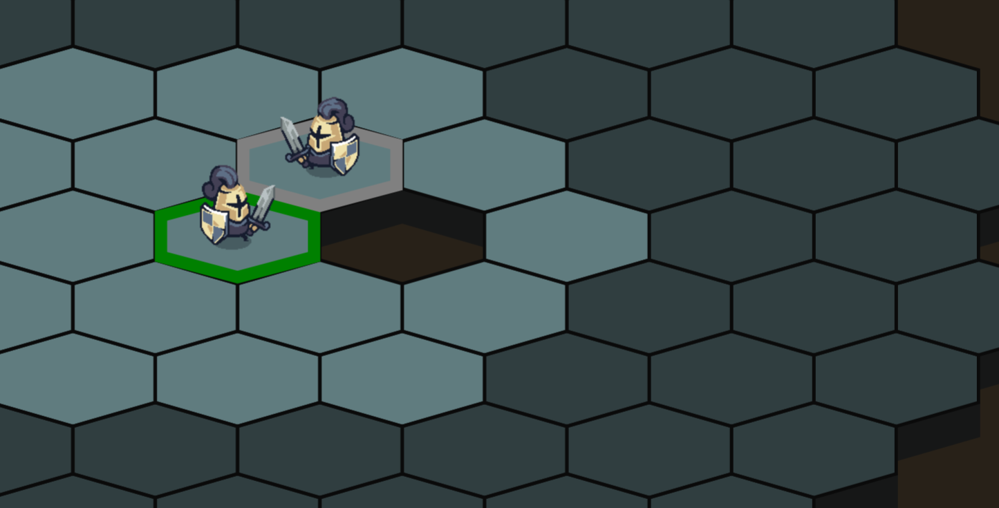
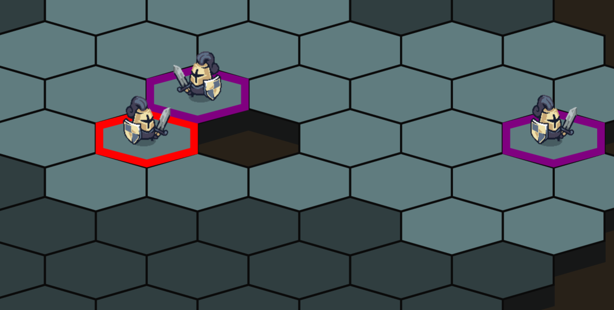

# 2DArena
This is a personal project. The goal was to combine two things I like: programming and games!
2DArena is a multiplayer turn-based, grid-based 1v1 game where each player controls multiple units. Units play one after the other, and each player can only see what's around their units. With limited actions per turn and a map that shrinks over time to prevent stalling, the goal is simple: eliminate all of your opponent's units.

## How It's Made:

**Tech used:** TypeScript, Java 25, Spring Boot, HTML canvas

### Step 1: Coordinates system, Field of View, PathFinding and Spawning

I implemented three coordinate systems:

- **Cubic coordinates:** For hex grid logic, each hex is represented as (q, r, s).
- **World coordinates:** Cartesian (x, y) centered around Hex(0,0,0). Used mainly for unit movement animations.
- **Screen coordinates:** World coordinates plus the camera offset. Used for rendering.

All coordinate conversions are handled in `Layout.ts`.

**Pathfinding** uses BFS (Breadth-First Search). BFS was sufficient for the map size and provided a straightforward implementation. The path preview displays on the frontend when hovering over a hex, then the server validates and calculates the final path when the player clicks.

  

&nbsp;

**Field of View** determines which hexes are visible around the unit. For each hex in range, a raycast checks for obstacles along the line of sight. The algorithm runs in O(r²) with r visiblity range per FOV update, which is simple and efficient enough since I avoid recomputing it on every fov update.

  
  

&nbsp;

**Spawning** uses Poisson Disk Sampling adapted to Hex grid.
The base algorithm is usually used in a continuous N-dimensional space. I adapted it to a discrete hex grid using cube coordinates, replacing Euclidean distance with cube distance. Since the grid is discrete and finite, I can just check every hex in the ring instead of picking random candidates.

- I pick a random valid hex as the starting point and add it to `placed` and `active`
- For each hex in `active`, I check all valid map hexes within `[minDist, 2×minDist]` steps
- I accept the first candidate that is at least `minDist` steps from all hexes in `placed`
- Accepted candidates are added to both `placed` and `active`
- Hexes with no valid candidate in range are removed from `active`
- I repeat until `active` is empty and return `placed`

The algorithm guarantees a minimum distance between all placed hexes, avoiding clustering. The randomness in the process gives the placement an organic feel.

### Step 2: Ui and Game Architecture

I wanted to use an event-driven architecture, but having every component interaction go through the event bus would create too much noise. So I use a hybrid approach: components that work together depend on each other directly via constructor injection, while the event bus handles higher-level actions like user input, server updates, and game actions (move, attack, skip turn, forfeit).

The code is organized around components with specific responsibilities: the map handles hex grid data, UnitManager tracks player and enemy units, PathPreviewManager calculates path previews, FovManager determines visibility, and so on. For example, pathfinding depends on the map for hex data and FovManager for visibility checks.

The main game loop in Game.ts switches between two states: MENU and GAME, each with different event listeners that swap on transition.
   
- GAME state: Handles hex hovers, clicks, and UI interactions
- MENU state: Only handles UI interactions

UI and Rendering:
Everything uses HTML Canvas. I use two stacked canvases, one for the game world (map, units, effects) and one for the UI (buttons, text). This separation makes it easier to update UI elements without redrawing the entire game state.
The map, buttons, and path previews are drawn with primitives like lines and circles. Hexes are twice as wide as they are tall to give the game a isometric look. This approach makes it easy to tweak the layout of the map or add procedural generation down the road.

Characters animate using sprite sheets, swapping between images every few frames.

### Step 3: Network Architecture

I use a combination of Rest and Websocket.

**REST API** handles communication:

- Authentication (login/register)
- Lobby management (join/leave lobby, leave game)

**WebSocket** handles real-time communication:

- Notifying other players of lobby changes (player joined/left)
- All in-game actions (move unit, skip turn, attack, forfeit game) sent by the player or server

This eliminates the need for polling and provides instant feedback to both players.

**Client-Server Validation Flow:**

When a player attempts an action:

1. **Client-side validation** - Quick checks like "is this my turn?", "is the target an ally?", "is this move valid?" provide immediate feedback
2. **Server proposal** - Client sends the action to the server
3. **Server validation** - Server performs authoritative checks and calculations (pathfinding, damage, game rules)
4. **Batch response** - Server sends up to 4 sequential messages to each player in a transaction:
    - `unit_attack` (the action result)
    - `turn_change` (optional - if turn switches)
    - `map_shrink` (optional - if the playable area shrinks)
    - `game_over` (optional - if the game ends)

I batch messages to ensure they are processed in the right order, preventing desynchronization issues.

### Step 4: Authentification

I implemented JWT-based authentication with Spring Security. Currently it only uses usernames (no passwords or database), but I structured it this way so adding proper user persistence later would be straightforward. It was also a good opportunity to learn how JWT actually works.

When a user logs in, the backend generates a JWT using a secret key (generated with openssl rand -base64 32 and stored in application.yml via environment variables, not committed to GitHub). The token is sent back to the client and the server doesn't store it anywhere.

The client includes the token in every request header.

For HTTP requests, JwtAuthFilter.java validates each token. If valid, it extracts the username and sets it in Spring Security Context so that if the request needs it i can get it using Principal.

For WebSocket connections, the same token is validated during the initial STOMP CONNECT in WebSocketConfig.java. The username is extracted and set in the Stomp Header Accessor until the session is stopped. Once connected, there is an additional check whenever someone subscribes to a channel, we verify they are actually in that room before letting them receive updates.

## Optimizations

The field of view uses a precomputed visibility map (O(n × r³) at game start) to avoid running the raycast algorithm on every FOV update. This map only gets recomputed when the playable area shrinks, since that's the only moment where obstacles can disappear and affect visibility.

The game initially didn't work on Chromium-based browsers (Chrome, Brave) on high refresh rate monitors (tested at 4K 240Hz and 1080p 480Hz), so I made two optimizations:

Since the map is drawn using primitives, redrawing it every frame was expensive. Instead, I use an offscreen canvas as a cache and draw it as an image onto the game canvas. The cache only redraws when the map actually changes: when the field of view updates, or when the camera moves or zooms.

The second optimization is that game logic runs at a fixed 60fps, while rendering still runs at the browser's native frame rate to avoid flickering during zoom.

## Things I would like to add
- Add sound to the game.
- Add randomness to map generation and unit spawning.

## The road to deployment
- Add an action point system to better balance movement and attacks within a single turn.
- Add spells to the game.
- Handle browser refresh gracefully by automatically removing the client from the backend.
- Stop the game and notify both players if a frontend error causes a desync.